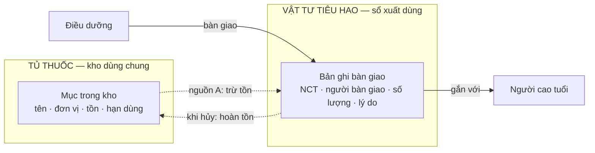
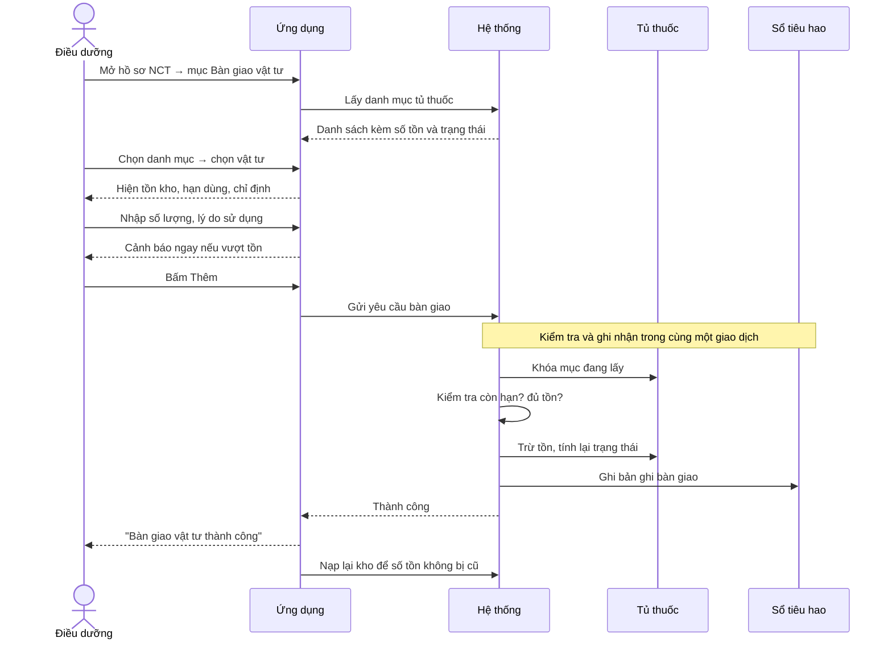

# Tài liệu nghiệp vụ — Module Tủ thuốc & Vật tư tiêu hao

**Hệ thống:** Quản lý viện dưỡng lão Xuân Hoa Care
**Phạm vi:** Nghiệp vụ quản lý kho thuốc/vật tư và ghi nhận xuất dùng cho người cao tuổi
**Đối tượng đọc:** Điều dưỡng trưởng, quản lý y tế, nhân sự nghiệp vụ, đội phát triển

---

## 1. Bối cảnh nghiệp vụ

Viện dưỡng lão duy trì một **tủ thuốc dùng chung** chứa thuốc và vật tư y tế phục vụ chăm sóc
hằng ngày: gạc, băng, kim chích, dây oxy, sonde, thuốc sát khuẩn…

Trước đây việc lấy vật tư ra dùng được ghi sổ giấy, dẫn tới ba vấn đề:

- Không biết chính xác **còn bao nhiêu** tại một thời điểm.
- Không truy được **ai đã lấy gì, cho ai, khi nào**.
- Phát hiện hết hàng hoặc hết hạn quá muộn, ảnh hưởng ca chăm sóc.

Module này giải quyết cả ba bằng cách gắn chặt hai việc vốn tách rời: **quản lý kho** và
**ghi nhận bàn giao cho người cao tuổi**. Mỗi lần điều dưỡng bàn giao vật tư, kho tự trừ ngay.

---

## 2. Từ điển thuật ngữ

| Thuật ngữ | Ý nghĩa nghiệp vụ |
|---|---|
| **Tủ thuốc** | Kho dùng chung của viện. Trả lời câu hỏi *"hiện còn gì, còn bao nhiêu"*. |
| **Vật tư** | Các mục trong tủ thuốc không phải thuốc uống (gạc, băng, kim, dây oxy…). Nằm chung trong tủ thuốc, phân biệt bằng danh mục. |
| **Vật tư tiêu hao** | Sổ nhật ký xuất dùng. Trả lời câu hỏi *"đã dùng những gì, cho ai"*. |
| **Bàn giao** | Hành vi điều dưỡng lấy vật tư ra dùng cho một người cao tuổi và ghi nhận lại. |
| **Tồn kho** | Số lượng hiện còn của một mục trong tủ thuốc. |
| **Ngưỡng tối thiểu** | Mức tồn mà khi chạm tới, hệ thống cảnh báo "sắp hết" để kịp bổ sung. |
| **NCT** | Người cao tuổi đang được chăm sóc tại viện. |

> **Lưu ý quan trọng:** "Vật tư" **không phải** một kho riêng. Thuốc và vật tư nằm chung
> trong tủ thuốc, chỉ khác nhau ở danh mục phân loại. Đừng hiểu thành hai kho tách biệt.

---

## 3. Vai trò tham gia

| Vai trò | Quyền và trách nhiệm trong module |
|---|---|
| **Điều dưỡng** | Xem tủ thuốc; bàn giao vật tư cho NCT; xem sổ tiêu hao trong ngày. Là người tạo ra hầu hết dữ liệu. |
| **Điều dưỡng trưởng / Quản lý y tế** | Theo dõi tồn kho, cảnh báo sắp hết và sắp hết hạn; đối chiếu sổ tiêu hao cuối ngày. |
| **NCT** | Đối tượng thụ hưởng. Mọi bản ghi tiêu hao đều phải gắn với đúng một NCT. |
| **Hệ thống** | Tự trừ kho, tự tính lại trạng thái tồn, tự chặn các thao tác vi phạm quy tắc. |

---

## 4. Module Tủ thuốc

### 4.1 Mục tiêu

Cho điều dưỡng và quản lý biết **tại thời điểm này, kho còn gì và dùng được không**,
đồng thời làm nguồn dữ liệu chuẩn cho việc bàn giao vật tư.

### 4.2 Thông tin quản lý cho mỗi mục

| Thông tin | Vai trò nghiệp vụ |
|---|---|
| Tên thuốc / vật tư | Tên gọi chuẩn, dùng thống nhất trong toàn hệ thống |
| Danh mục phân loại | Nhóm mục theo mục đích sử dụng, phục vụ tìm kiếm và lọc |
| Đơn vị tính | Viên, gói, cuộn, chiếc… — đơn vị để đếm và bàn giao |
| Số lượng tồn | Còn lại bao nhiêu tại thời điểm hiện tại |
| Ngưỡng tối thiểu | Mức cảnh báo riêng cho từng mục |
| Hạn sử dụng | Có thể để trống với vật tư không có hạn |
| Chỉ định | Ghi chú dùng trong trường hợp nào — hiển thị cho điều dưỡng lúc chọn |
| Trạng thái | Kết quả tự tính, xem mục 4.3 |

### 4.3 Bốn trạng thái tồn kho

Trạng thái **không do người dùng đặt**. Hệ thống tự tính lại sau mỗi lần tồn kho thay đổi,
theo thứ tự ưu tiên — khớp điều kiện nào trước thì lấy trạng thái đó:

| Ưu tiên | Trạng thái | Điều kiện | Ý nghĩa với điều dưỡng |
|:---:|---|---|---|
| 1 | **Hết hạn** | Quá hạn sử dụng | Không được dùng, dù còn tồn. Phải loại bỏ. |
| 2 | **Hết hàng** | Tồn bằng 0 | Không lấy được. Cần nhập bổ sung. |
| 3 | **Sắp hết** | Tồn ≤ ngưỡng tối thiểu | Vẫn dùng được nhưng phải báo bổ sung. |
| 4 | **Còn hàng** | Các trường hợp còn lại | Bình thường. |

Hết hạn xếp trên hết hàng vì hàng quá hạn thì **dù còn tồn vẫn không có giá trị sử dụng** —
đây là quy tắc an toàn, không phải quy tắc kho.

### 4.4 Chức năng trên ứng dụng điều dưỡng

Trên màn **Công việc hằng ngày** có một thẻ tổng quan tủ thuốc, hiện số mục cần chú ý
(sắp hết + hết hàng + hết hạn). Bấm vào mở màn tủ thuốc đầy đủ gồm:

- **Thống kê nhanh:** tổng số mục, tổng tồn, số mục theo từng trạng thái, số mục sắp hết hạn trong 30 ngày.
- **Tìm kiếm** theo tên thuốc/vật tư.
- **Lọc** theo danh mục và theo trạng thái tồn.
- **Danh sách** ưu tiên đẩy hàng có vấn đề lên đầu: hết hàng → hết hạn → sắp hết → còn hàng.

Điểm cần nắm: **tủ thuốc trên app là màn hình chỉ để xem**. Điều dưỡng không sửa tồn kho trực tiếp.
Tồn kho chỉ thay đổi như *hệ quả* của việc bàn giao vật tư.

---

## 5. Liên hệ giữa Tủ thuốc và Vật tư tiêu hao

### 5.1 Quan hệ nghiệp vụ

Hai module là hai mặt của cùng một sự việc:

| | Tủ thuốc | Vật tư tiêu hao |
|---|---|---|
| Trả lời | *Còn gì?* | *Đã dùng gì?* |
| Bản chất | Trạng thái tại một thời điểm | Lịch sử theo thời gian |
| Thay đổi khi nào | Khi có bàn giao | Khi có bàn giao |

**Nguyên tắc nền tảng: mỗi lần bàn giao là một lần xuất kho.**
Không có đường nào để trừ kho mà không sinh bản ghi tiêu hao, và ngược lại — một bản ghi
tiêu hao lấy từ kho luôn kéo theo việc trừ tồn. Hai việc này xảy ra **đồng thời hoặc không xảy ra**.

### 5.2 Hai nguồn vật tư

Thực tế chăm sóc có những vật tư không nằm trong tủ thuốc chung (người nhà mang vào,
vật tư mượn tạm, đồ dùng riêng của NCT). Hệ thống vì vậy cho phép hai nguồn:

| | **Nguồn A — Lấy từ tủ thuốc** | **Nguồn B — Vật tư ngoài kho** |
|---|---|---|
| Điều dưỡng chọn từ | Danh sách kho thật, có số tồn | Danh mục vật tư chuẩn (6 nhóm A–F) |
| Tên và đơn vị tính | Hệ thống tự điền theo kho | Điều dưỡng nhập |
| Kiểm tra tồn kho | Có | Không |
| Kiểm tra hạn sử dụng | Có | Không |
| Trừ tồn kho | **Có** | **Không** |
| Dùng khi nào | Vật tư của viện | Vật tư ngoài viện, không thuộc kho chung |

Cả hai đều tạo ra bản ghi trong sổ tiêu hao. Khác biệt duy nhất là **có chạm vào kho hay không**.

### 5.3 Sơ đồ quan hệ

Đường nét đứt là quan hệ **có điều kiện** — chỉ tồn tại với bản ghi lấy từ nguồn A.
Bản ghi nguồn B nằm hoàn toàn bên phải sơ đồ, không nối sang kho.

---

## 6. Luồng hoạt động

### 6.1 Luồng chính — Bàn giao vật tư lấy từ tủ thuốc

Bối cảnh: điều dưỡng thay băng cho một NCT, cần lấy 2 gói gạc vô khuẩn từ tủ thuốc.

**Diễn giải các bước:**

1. Điều dưỡng mở hồ sơ NCT, vào mục bàn giao vật tư.
2. Chọn chế độ **Lấy từ tủ thuốc**.
3. Lọc theo danh mục cho gọn, rồi chọn vật tư. Mục đang hết hàng hoặc hết hạn **vẫn hiển thị nhưng bị làm mờ và không chọn được** — để điều dưỡng biết là có tồn tại mà đang không dùng được, thay vì tưởng viện không có.
4. Sau khi chọn, màn hình hiện ngay tồn kho, cảnh báo nếu sắp hết hạn, và chỉ định sử dụng.
5. Nhập số lượng. Đơn vị tính tự điền theo kho và khóa lại, không cho sửa.
6. Nhập lý do sử dụng (không bắt buộc).
7. Bấm **Thêm**. Hệ thống kiểm tra lại toàn bộ điều kiện ở phía máy chủ rồi mới ghi nhận.

### 6.2 Luồng phụ — Bàn giao vật tư ngoài kho

Giống luồng chính nhưng:

- Chọn chế độ **Vật tư khác**.
- Chọn nhóm và tên vật tư từ danh mục chuẩn 6 nhóm (A–F: thay băng, theo dõi sức khỏe, chăm sóc hô hấp, ăn qua sonde, cấp cứu, phòng ngừa loét tỳ đè).
- Tự nhập đơn vị tính.
- Hệ thống **không kiểm tra tồn kho, không kiểm tra hạn, không trừ kho**. Chỉ ghi vào sổ tiêu hao.

### 6.3 Luồng hủy — Hoàn lại kho

Khi một bản ghi bàn giao được xác định là nhầm hoặc không thực hiện:

| Chuyển trạng thái | Tác động lên kho |
|---|---|
| Bất kỳ → **Đã hủy** | Cộng trả lại số lượng vào tồn kho |
| **Đã hủy** → trạng thái khác | Trừ kho lại lần nữa, có kiểm tra đủ tồn trước |

Bản ghi từ nguồn B (ngoài kho) khi hủy **không tác động gì tới kho**, vì lúc tạo cũng không trừ.

> **Hiện trạng:** chức năng đổi trạng thái đã có ở phía máy chủ nhưng **ứng dụng điều dưỡng
> chưa có màn hình gọi tới**. Trên thực tế luồng hủy chưa dùng được. Cần bổ sung nếu nghiệp vụ yêu cầu.

### 6.4 Luồng theo dõi cuối ngày

Trên màn **Công việc hằng ngày** có lối tắt mở sổ **Vật tư tiêu hao hôm nay**, liệt kê mọi
bản ghi phát sinh trong ngày, mỗi dòng hiển thị: tên vật tư, NCT nhận, người bàn giao,
số lượng kèm đơn vị, trạng thái và giờ bàn giao. Có ô tìm kiếm theo tên vật tư hoặc tên NCT.

Đây là công cụ để điều dưỡng trưởng đối chiếu cuối ca.

---

## 7. Quy tắc nghiệp vụ

| Mã | Quy tắc |
|---|---|
| **QT-01** | Mọi bản ghi tiêu hao phải gắn với đúng một NCT. |
| **QT-02** | Số lượng bàn giao phải lớn hơn 0. |
| **QT-03** | Phải chọn được vật tư trong kho **hoặc** nhập tên vật tư. Không được để trống cả hai. |
| **QT-04** | Không xuất được vật tư đã quá hạn sử dụng, kể cả khi còn tồn. |
| **QT-05** | Không xuất quá số lượng đang tồn. |
| **QT-06** | Với vật tư lấy từ kho, tên và đơn vị tính **luôn lấy theo kho**, không lấy theo dữ liệu người dùng gửi lên — để tên trong sổ không bao giờ lệch với tên trong kho. |
| **QT-07** | Trừ kho và ghi sổ phải xảy ra cùng lúc. Nếu một trong hai thất bại thì hủy toàn bộ, kho giữ nguyên. |
| **QT-08** | Hai điều dưỡng cùng lấy một mục tại cùng thời điểm sẽ được xử lý tuần tự. Kho không bao giờ âm. |
| **QT-09** | Trạng thái tồn kho luôn do hệ thống tính, không ai đặt tay. |
| **QT-10** | Người bàn giao được lấy tự động từ tài khoản đang đăng nhập, không cho chọn. |

---

## 8. Tình huống ngoại lệ

| Tình huống | Hệ thống xử lý | Điều dưỡng thấy gì |
|---|---|---|
| Chọn vật tư đã hết hạn | Chặn ngay từ danh sách | Mục bị làm mờ, không chọn được |
| Nhập số lượng vượt tồn | Cảnh báo ngay khi đang gõ, chưa cần gửi | *"Chỉ còn N \<đơn vị\>"* dưới ô nhập |
| Tồn thay đổi giữa lúc đang nhập | Máy chủ kiểm tra lại lần nữa lúc gửi | *"Tồn kho không đủ: … chỉ còn N \<đơn vị\>"* |
| Vật tư vừa bị xóa khỏi kho | Máy chủ từ chối | *"Không tìm thấy thuốc/vật tư trong tủ thuốc"* |
| Mất mạng khi gửi | Không ghi gì cả, kho giữ nguyên | *"Không kết nối được máy chủ. Kiểm tra lại mạng."* |
| Tủ thuốc chưa có dữ liệu | Form hiện thông báo kèm nút thử lại | *"Tủ thuốc chưa có dữ liệu"* |

---

## 9. Vòng đời bản ghi vật tư tiêu hao

| Trạng thái | Ý nghĩa nghiệp vụ |
|---|---|
| **Chờ duyệt** | Đã ghi nhận, chờ cấp trên xác nhận |
| **Đã duyệt** | Đã được xác nhận |
| **Đã dùng** | Đã bàn giao và sử dụng — **trạng thái mặc định khi tạo** |
| **Đã hủy** | Không thực hiện. Nếu lấy từ kho thì tồn đã được hoàn lại |

Mặc định là **Đã dùng** chứ không phải *Chờ duyệt*, vì kho đã bị trừ ngay tại thời điểm bàn giao.
Nói cách khác: **nghiệp vụ hiện tại là ghi nhận sau khi đã dùng, không phải xin duyệt trước khi dùng.**
Hai trạng thái *Chờ duyệt* và *Đã duyệt* đã được định nghĩa sẵn nhưng quy trình duyệt chưa được triển khai.

---

## 10. Giới hạn hiện tại

Những nghiệp vụ **chưa được hệ thống đáp ứng**, cần biết khi lập kế hoạch:

| Nghiệp vụ | Hiện trạng |
|---|---|
| **Nhập kho** | Chưa có. Không có chức năng thêm mục mới hay cộng tồn khi hàng về. Dữ liệu tủ thuốc phải nạp trực tiếp vào cơ sở dữ liệu. |
| **Sửa / xóa mục trong kho** | Chưa có trên ứng dụng. |
| **Quy trình duyệt** | Trạng thái đã định nghĩa nhưng chưa có luồng duyệt thực tế. |
| **Hủy bản ghi & hoàn kho** | Máy chủ đã hỗ trợ, ứng dụng chưa có màn hình. |
| **Kiểm kê định kỳ** | Chưa có. Không có chức năng đối chiếu tồn sổ với tồn thực tế. |
| **Lịch sử biến động kho** | Chưa có sổ riêng. Chỉ suy ra gián tiếp từ sổ tiêu hao. |
| **Phân quyền theo vai trò** | Hiện mọi tài khoản đã đăng nhập đều gọi được chức năng bàn giao. Chưa giới hạn riêng cho điều dưỡng. |
| **Xem tiêu hao theo từng NCT** | Máy chủ hỗ trợ lọc theo NCT, ứng dụng mới chỉ có sổ theo ngày. |

---

*Cập nhật: 04/09/2026*
